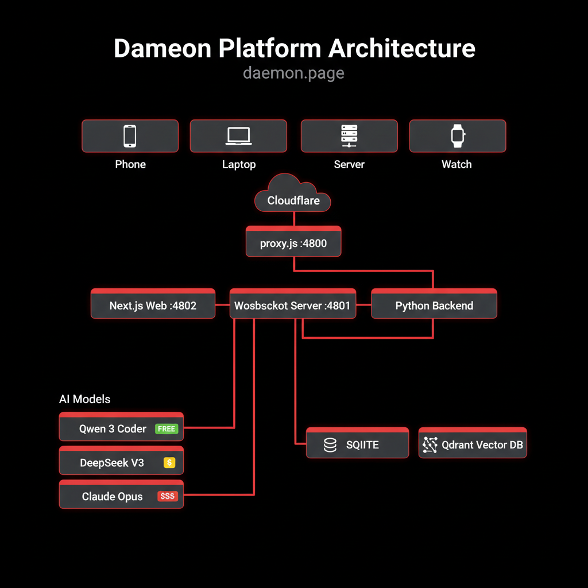

<div align="center">
  
  <h1>daemon</h1>
  <p><strong>One AI agent. Terminal access to every device you own.</strong></p>
  <p>Open source &bull; Multi-device &bull; Free tier included &bull; Bring your own keys</p>

  <a href="https://daemon.page">Website</a> &bull;
  <a href="https://daemon.page/download">Download</a> &bull;
  <a href="SPEC.md">Spec</a> &bull;
  <a href="docs/">Docs</a>
</div>

---

## What is Daemon?

Daemon connects all your devices -- laptop, phone, server -- into one AI-powered workspace. Chat with your daemon, and it runs commands on any connected device, syncs your clipboard, deploys your apps, and remembers everything across sessions.

**Free tier**: Qwen3-Coder via OpenRouter. No credit card needed.
**Bring your own key**: Paste your Anthropic/OpenAI/DeepSeek key.
**Link Claude Max**: Use your $100/mo subscription through Daemon.

## Quick Start

```bash
# Install on any device (macOS, Linux, Windows)
curl -sSL daemon.page/install.sh | bash

# Pair with your account
daemon pair <CODE>  # Get code at daemon.page/download

# That's it. Your device is connected.
```

## Features

- **Multi-device mesh** -- Connect phone, laptop, server. Run commands on any device from anywhere.
- **Clipboard sync** -- Copy on your phone, paste on your laptop. Automatic.
- **One-click deploy** -- `/deploy` publishes to username.daemon.page instantly.
- **Persistent memory** -- Your daemon remembers across sessions. Never re-explain context.
- **Slash commands** -- `/commit`, `/deploy`, `/review`, `/search` -- power tools built in.
- **Your data stays yours** -- Local-first. Open source. Self-hostable.
- **Any model** -- Qwen (free), DeepSeek, Claude, GPT -- bring your own keys.
- **Native apps** -- Android, Windows, macOS, Linux. Same experience everywhere.

## How it works

<div align="center">
  
</div>

1. Install daemon on your devices
2. Each device connects via WebSocket to the daemon server
3. Chat with your AI -- it can run commands on any connected device
4. Deploy apps, sync files, search memory -- all through one conversation

## vs. Alternatives

| | Daemon | Claude Code | Cursor | Windsurf |
|---|---|---|---|---|
| Multi-device | All devices | One terminal | One IDE | One IDE |
| Free tier | Qwen unlimited | $20+/mo | $20/mo | $15/mo |
| Deploy apps | your.daemon.page | -- | -- | -- |
| Clipboard sync | Cross-device | -- | -- | -- |
| Memory | Persistent | Session only | -- | -- |
| Open source | MIT | -- | -- | -- |
| Self-hostable | Docker compose | -- | -- | -- |
| BYOK | Any provider | Anthropic only | Multiple | Multiple |

## Architecture

Daemon is a monorepo with four main components:

- **`web/`** -- Next.js web UI and API server (port 4800)
- **`cli/`** -- Cross-platform device bridge (Node.js)
- **`android/`** -- Native Android app (Kotlin/Jetpack Compose)
- **`desktop/`** -- Desktop bridge (Tauri/Rust)
- **`protocol/`** -- Shared protocol types (TypeScript)

The server coordinates WebSocket connections between devices and routes AI requests through a 3-tier model router (free Qwen -> mid DeepSeek -> premium Claude/GPT via BYOK).

See [SPEC.md](SPEC.md) for the full v0 specification (7,300 words covering protocol, security, agent architecture, and deployment).

## Self-hosting

```bash
git clone https://github.com/arthurcamara/daemon.git
cd daemon
docker compose up -d
```

Requires: Node.js 20+, SQLite. See [docs/](docs/) for detailed setup.

## Contributing

We welcome contributions. Daemon is built in the open.

- Read [CONTRIBUTING.md](CONTRIBUTING.md) before making changes
- Read [SPEC.md](SPEC.md) for architecture decisions
- Follow the rules in [CLAUDE.md](CLAUDE.md)

## License

[MIT](LICENSE) -- Copyright 2026 Arthur Camara
