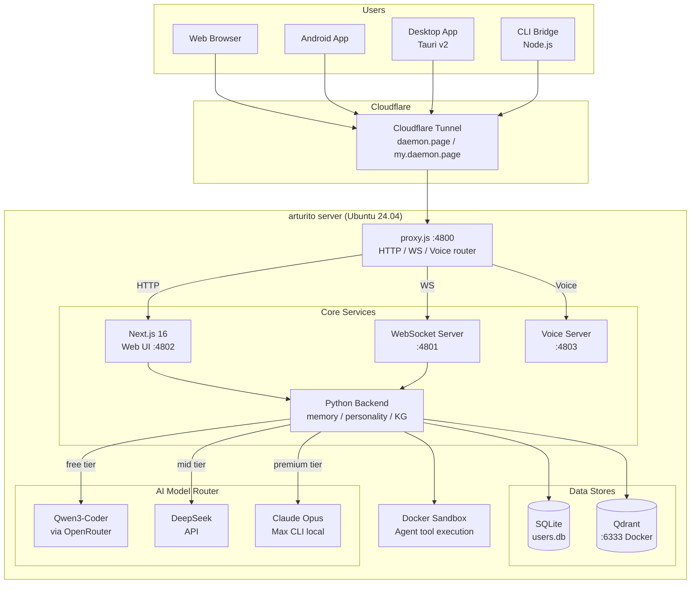
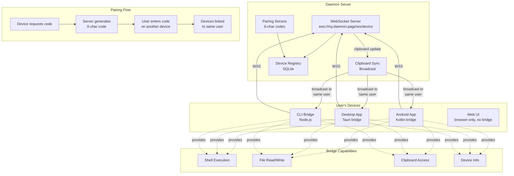
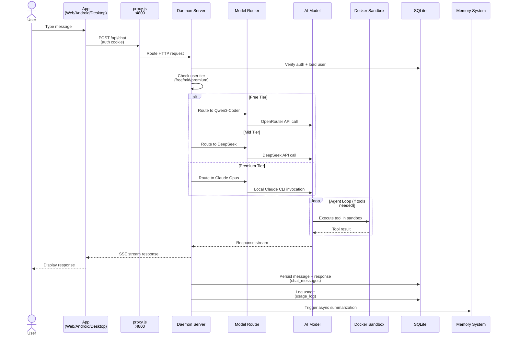
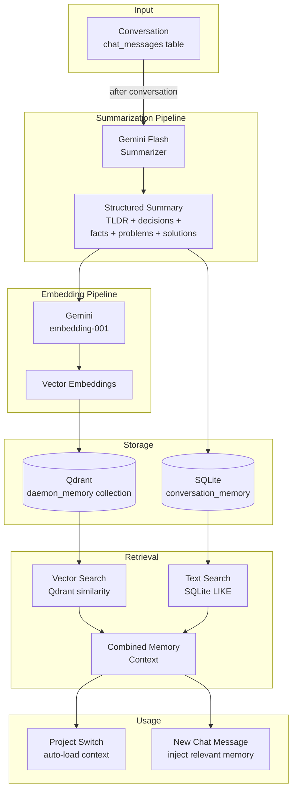
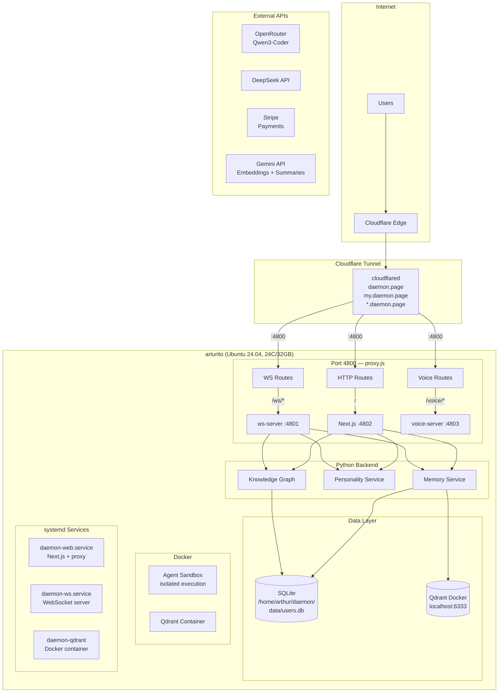
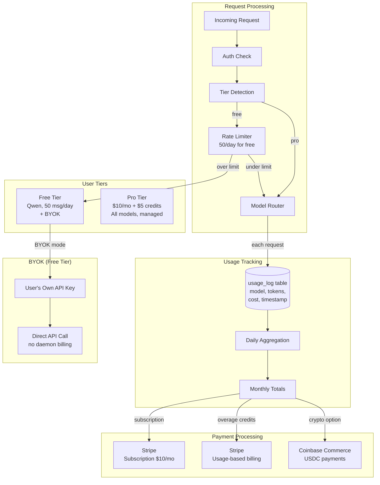

# Daemon Platform Architecture

Detailed architecture diagrams for the Daemon multi-device AI agent platform.

---

## 1. System Overview

---

## 2. Device Mesh

---

## 3. Chat Message Flow

---

## 4. Memory System

---

## 5. Infrastructure

---

## 6. Billing Flow

