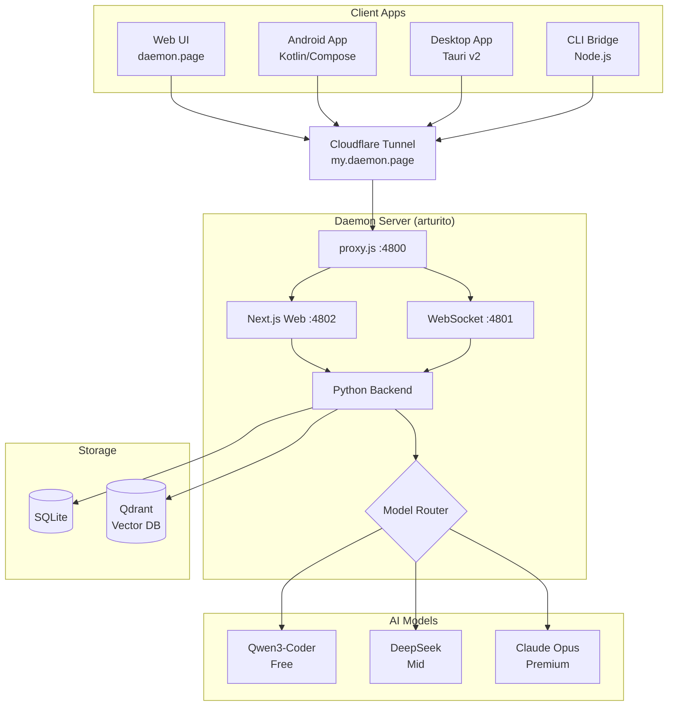

# Daemon Platform Overview

Daemon is a multi-device AI agent platform. Users interact through native apps or the web, and a central server routes their requests to the best AI model for their tier.

## Components

**Client Apps** -- Native apps for Android (Kotlin/Compose), Windows/Mac/Linux (Tauri v2 with Rust + WebView), a Node.js CLI bridge for headless use, and a Next.js web UI. All connect through Cloudflare Tunnel to the server.

**Proxy (proxy.js)** -- Single entry point on port 4800. Routes HTTP to Next.js, WebSocket connections to the WS server, and voice traffic to the voice server.

**Python Backend** -- Handles memory management, personality configuration, and the knowledge graph. Orchestrates the AI model routing and agent tool execution.

**Model Router** -- Three tiers: Qwen3-Coder (free, via OpenRouter, 50 msg/day), DeepSeek (mid tier), Claude Opus (premium, local Max CLI). Users can also bring their own API keys.

**Device Mesh** -- Each device with a bridge connects via WSS and provides shell execution, file I/O, and clipboard sync. Devices pair with 6-character codes -- no VPN required.

**Memory System** -- Conversations are stored in SQLite, then summarized by Gemini Flash into structured memory (decisions, facts, problems, solutions). Summaries are embedded and stored in Qdrant for vector search. Memory auto-loads on project switch.

**Storage** -- SQLite holds users, conversations, memory summaries, and usage logs. Qdrant (Docker, port 6333) holds vector embeddings for semantic memory search.

**Infrastructure** -- Runs on arturito (Ubuntu 24.04, 24 cores, 32GB RAM). Cloudflare Tunnel exposes daemon.page and my.daemon.page. Agent tool calls execute in a Docker sandbox.

**Billing** -- Free tier gets Qwen with a daily limit plus BYOK. Pro ($10/mo + $5 credits) gets all models managed. Usage tracked per-request in SQLite. Stripe for cards, Coinbase Commerce for USDC.
